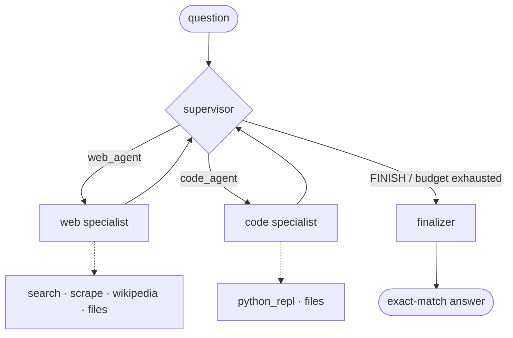

# Architecture

## Shape

A **supervisor** routes each turn to one **specialist**, or to a **finalizer**
that produces the graded answer. Specialists are ReAct loops over a scoped
toolset.

## Layers

| Package | Responsibility | Depends on |
|---|---|---|
| `agent.config` | All environment reading, in one frozen `Settings` | nothing |
| `agent.obs` | Logging, LangSmith tracing, metrics | `config` |
| `agent.tools` | Capability registry + tool implementations | `config`, `obs` |
| `agent.agents` | Specialist specs + the shared ReAct loop | `tools`, `core.llm` |
| `agent.core` | State, model factory, supervisor graph | `agents`, `obs` |
| `agent.eval` | Benchmark runner, scorers | `core` |
| `agent.cli` / `app.py` | Entry points | `eval` |

Dependencies point one way. Nothing below `core` imports the graph.

## Why this shape

**One loop, many specialists.** Every specialist is the same reason → maybe call
tools → repeat cycle. That loop lives once in `agents/base.py`; a specialist is
declared as data (`SpecialistSpec`: prompt, tools, iteration cap). Adding one is
a `spec()` function and an entry in `SPEC_BUILDERS` — the router schema, the
graph nodes, and the supervisor's prompt roster all derive from that list.

**Capabilities, not imports.** Specialists request `get_tools("search", "files")`
rather than importing concrete tools. A new tool registers itself and becomes
available to every specialist holding that capability.

**Budgets everywhere.** Three nested bounds, each independently sufficient to
guarantee termination:

| Bound | Default | What it stops |
|---|---|---|
| `max_supervisor_steps` | 4 | Supervisor ping-ponging between specialists |
| `max_*_iterations` | 3 | A specialist looping on a failing tool |
| `recursion_limit` | derived (18) | Anything the first two miss |
| `per_question_timeout_s` | 180 | One task consuming the run |
| `total_budget_s` | 2400 | The run outliving its host |

**Degradation over failure.** A missing credential produces a tool *message*
("web_search is unavailable: TAVILY_API_KEY is not configured; use
scrape_webpage instead"), never an exception. The model reads it and adapts.
Nothing is constructed at import time — see
[ADR 0003](adr/0003-lazy-tool-initialisation.md).

## Data flow for one task

1. `BenchmarkRunner.build_prompt` renders the question and, if the task has an
   attachment, instructs the model to call `download_task_file`.
2. `Orchestrator.answer` invokes the graph with a trace config carrying `task_id`.
3. The supervisor routes; specialists run; history is trimmed to a window before
   every model call so token spend stays bounded.
4. The finalizer compresses the transcript into a bare answer.
5. `run_one` records a `TaskMetric`; the answer is cached to disk immediately.

Submission is a **separate action** reading that cache, so a dropped connection
during a 40-minute run costs nothing.
